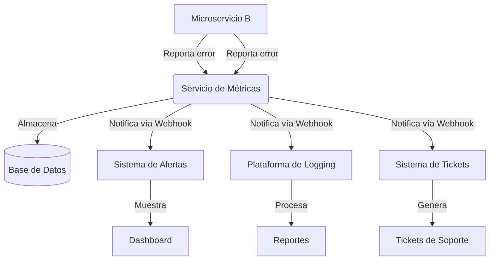
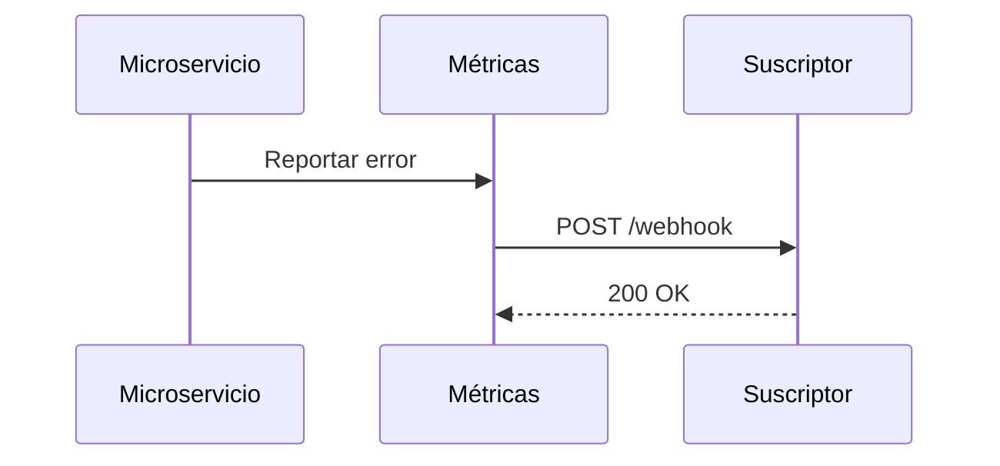

```mermaid
graph TD
    A[Microservicio A] -->|Reporta error| B(Servicio de Métricas)
    A[Microservicio B] -->|Reporta error| B
    B -->|Almacena| C[(Base de Datos)]
    B -->|Notifica vía Webhook| D[Sistema de Alertas]
    B -->|Notifica vía Webhook| E[Plataforma de Logging]
    B -->|Notifica vía Webhook| F[Sistema de Tickets]
    D -->|Muestra| G[Dashboard]
    E -->|Procesa| H[Reportes]
    F -->|Genera| I[Tickets de Soporte]
```
---

```mermaid
sequenceDiagram
  participant Microservicio
  participant Métricas
  participant Suscriptor
  Microservicio->>Métricas: Reportar error
  Métricas->>Suscriptor: POST /webhook
  Suscriptor-->>Métricas: 200 OK
```